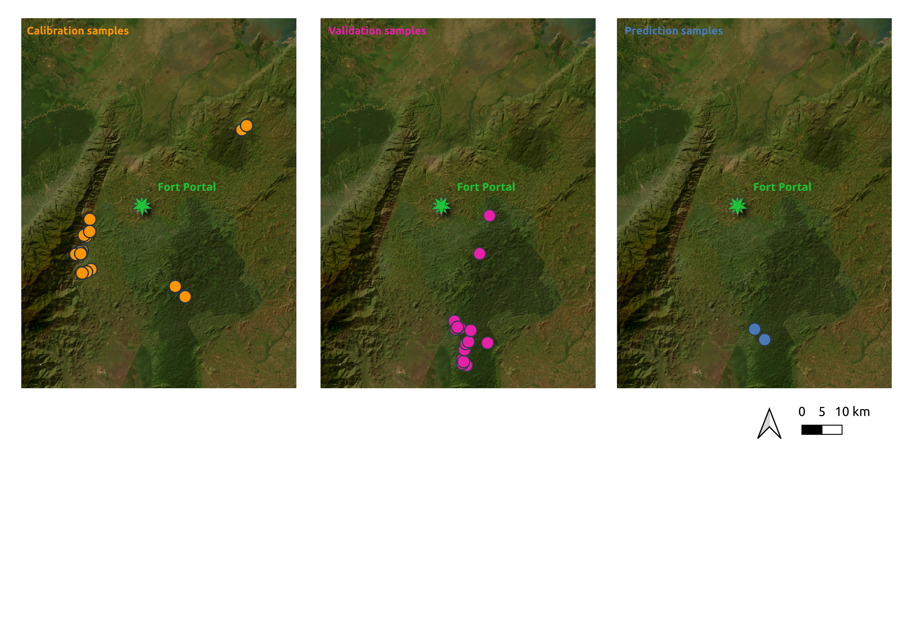

```{r setup, include=FALSE}
knitr::opts_chunk$set(echo = TRUE, message = FALSE, warning = FALSE)
```


**Data for soil near-infrared calibration modeling exercises**

*Leonardo Ramirez-Lopez, Moritz Mainka, Laura Summerauer*


```{r echo = FALSE}

```


# Calibration data

## TropSOC data from Uganda (cropland and forest)

- Forest samples were taken from the Kibale National Park
- Cropland samples were taken from the Rwenzori foothills, West of Kibale National Park

```{r}
tropsoc_data <- readRDS("data/calibration_data/NIRabs_TropSOC_Uganda.rds")

str(tropsoc_data)
```

- Absorbance spectra in NIR range
- Units are wavenumbers (1 / cm)

```{r}
range(as.numeric(colnames(tropsoc_data$abs)))
```


## Uganda samples from PhD project Laura

cropland samples only from:

- Rwenzori foothills (West of Kibale NP) 
- East of Kibale NP
- Saaka / volcanic area in Fort Portal (Saaka University campus)
- I very much recommend to **remove Saaka samples prior to modeling**, since these are substantially different from all the other samples!! 

```{r}
laura_data <- readRDS("data/calibration_data/NIRabs_PhDLaura_Uganda.rds")

str(laura_data)
```

## Calibration modeling (cross-validation)

- Use here merged TropSOC and Laura samples (except volcanic Saaka samples)
- 151 samples

```{r}
alldata <- readRDS("data/calibration_data/NIRabs_allUganda_noSaaka.rds")

str(alldata)
```

### Pre-process / smoothen spectra

```{r}
wavs <- as.numeric(colnames(alldata$abs))
wavs_pre <- as.numeric(colnames(alldata$abs_pre))

alldata$abs_pre <- alldata$abs |>
  prospectr::movav(w = 19)
  # detrend(wav = wavs_pre, p = 2)
  # standardNormalVariate() 
  # savitzkyGolay(m = 2, p = 2, w = 17) 
```

### Visualization

```{r}
# all raw spectra
matplot(x = as.numeric(colnames(alldata$abs)), y = t(alldata$abs),
        xlab = expression(paste("Wavenumber ", cm^{-1})),
        ylab = 'Absorbance',
        type = 'l',
        lty = 1, 
        main = "All raw spectra",
        # ylim = c(0.2, 0.8),
        xlim = c(7500, 3900))


# raw absorbance
matplot(x = as.numeric(colnames(alldata$abs)), y = alldata$abs[1,],
        xlab = expression(paste("Wavenumber ", cm^{-1})),
        ylab = 'Absorbance',
        type = 'l',
        lty = 1, 
        main = "Raw spectra",
        # ylim = c(0.2, 0.8),
        xlim = c(7500, 3900))

# pre-processed absorbance data
matplot(x = as.numeric(colnames(alldata$abs_pre)), y = alldata$abs_pre[1,],
        xlab = expression(paste("Wavenumber ", cm^{-1})),
        ylab = 'Absorbance',
        type = 'l',
        lty = 1, 
        main = "Pre-processed spectra",
        # ylim = c(0.2, 0.8),
        xlim = c(7500, 3900))
```


### PLS modeling

```{r}
library(caret)
library(tidyverse)

# maxiumum number of components
pls_ncomp_max <- 10

## define trainControl
train_control <- trainControl(
  method = "repeatedcv",
  savePredictions = TRUE, selectionFunction = "oneSE"
)

alldata$rowIndex <- c(1:nrow(alldata))


## train a pls regression model
pls_model <- train(x = alldata$abs_pre,
                       y = alldata$TC_gkg,
                       method = "pls",
                       tuneLength = pls_ncomp_max,
                       trControl = train_control,
                       preProcess = c("center", "scale"))


pls_model
plot(pls_model)
range(alldata$TC_gkg)

```


```{r echo = FALSE}

source("R/pls_eval.R")

eval <- pls_val_plot(pls_object = pls_model, data = alldata, ID = "sample_id", property = "TC", unit = "g/kg", label = "SOC", val_type = "CV")
eval$p_calval
```


## Calibration modeling (independent validation)


```{r}
# kennard-Stone sampling for independent validation
kS <- prospectr::kenStone(X = alldata$abs_pre, k = 2/3*nrow(alldata),
               metric = "mahal", pc = 10,
               # group = as.factor(alldata$core_id),
               .center = TRUE, .scale = FALSE)


calset <- alldata[kS$model,]
valset <- alldata[kS$test,]

calset$rowIndex <- c(1:nrow(calset))

## train a pls regression model
pls_model_iv <- caret::train(x = calset$abs_pre,
                          y = calset$TC_gkg,
                          method = "pls",
                          tuneLength = pls_ncomp_max,
                          trControl = train_control,
                          preProcess = c("center", "scale"))

pls_model_iv


```


```{r echo = FALSE}
ind_validation <- pls_val_plot(pls_object = pls_model_iv, data = calset, ID = "sample_id",
                               property = "TC_gkg", unit = "g/kg", label = "SOC",
                               val_type = "ind_val", valset = valset)

ind_validation$p_calval
```


# Validation samples

These validation samples will be measured with an infrared spectrometer. Since we have available SOC data from the laboratory, we can use these samples to validate our models. 

- Samples were provided by Matt Cooper
- Samples from Kibale National Park
- Dried, sieved and ground soil
- Reference SOC data were measured at ETH Zurich using dry combustion

```{r}
validation_samples <- read_csv("data/validation_samples/validation_samples.csv")

head(validation_samples)
```


# Prediction samples

These prediction samples will be measured with an infrared spectrometer. After knowing the uncertainty of such prediction models by the validation samples (above), we can use the established model to predict SOC data for these samples. 

- Samples were provided by Matt Cooper (2 contrasting soil cores)
- Samples from Kibale National Park
- Dried, sieved and ground soil

```{r}
prediction_samples <- read_csv("data/prediction_samples/prediction_samples.csv")

head(prediction_samples)
```

