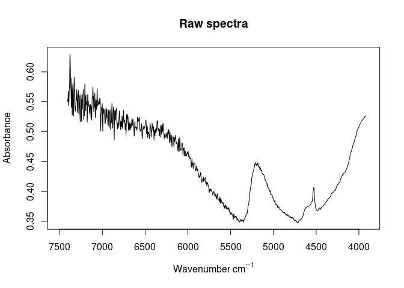
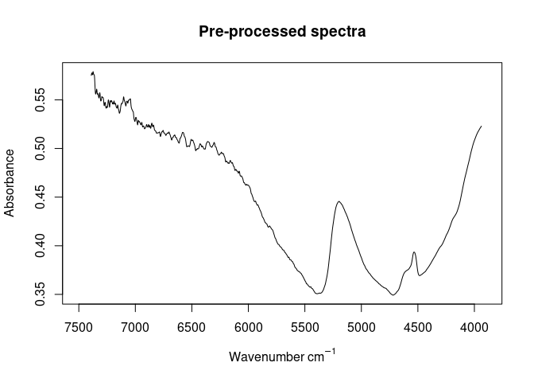
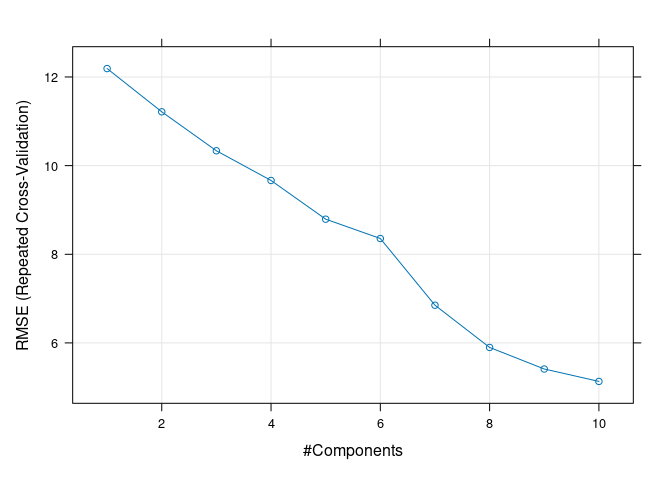
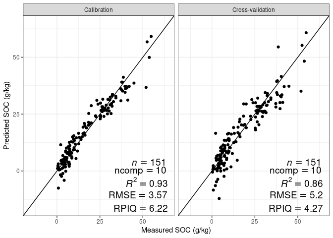

TROPIRES Summer School Uganda August 19–23 2024
================

Data for soil near-infrared calibration modeling exercises

Leonardo Ramirez-Lopez, Moritz Mainka, Laura Summerauer

# Data overview

## TropSOC data from Uganda (cropland and forest)

- Forest samples come from the Kibale National Park
- Cropland samples were taken from the Rwenzori foothills, West of
  Kibale National Park

``` r
tropsoc_data <- readRDS("data/calibration_data/NIRabs_TropSOC_Uganda.rds")

str(tropsoc_data)
```

    ## 'data.frame':    100 obs. of  9 variables:
    ##  $ sample_id   : chr  "UF10C1" "UF10C10" "UF10C4" "UF10C7" ...
    ##  $ core_id     : chr  "UF10" "UF10" "UF10" "UF10" ...
    ##  $ country_code: chr  "UGA" "UGA" "UGA" "UGA" ...
    ##  $ lat         : num  0.522 0.522 0.522 0.522 0.516 ...
    ##  $ long        : num  30.2 30.2 30.2 30.2 30.2 ...
    ##  $ land_use    : chr  "cropland" "cropland" "cropland" "cropland" ...
    ##  $ depth       : chr  "0-10" "90-100" "30-40" "60-70" ...
    ##  $ TC_gkg      : num  31.79 7.3 27.49 8.27 32.91 ...
    ##  $ abs         : num [1:100, 1:1745] 0.571 0.564 0.605 0.656 0.609 ...
    ##   ..- attr(*, "dimnames")=List of 2
    ##   .. ..$ : NULL
    ##   .. ..$ : chr [1:1745] "7408" "7406" "7404" "7402" ...

### Absorbance spectra in NIR range

- Units are wavenumbers (1 / cm)

``` r
range(as.numeric(colnames(tropsoc_data$abs)))
```

    ## [1] 3920 7408

## Samples from PhD project Laura

cropland samples only from:

- Rwenzori foothills (West of Kibale NP)
- East of Kibale NP
- Saaka / volcanic area in Fort Portal (Saaka University campus)
- I very much recommend to **remove Saaka samples from modeling**, since
  these are substantially different from all the other samples!!

``` r
laura_data <- readRDS("data/calibration_data/NIRabs_PhDLaura_Uganda.rds")

str(laura_data)
```

    ## 'data.frame':    105 obs. of  9 variables:
    ##  $ sample_id   : chr  "uga_saak1_p2_0-10" "uga_saak1_p2_10-20" "uga_saak1_p2_20-30" "uga_saak1_p2_30-40" ...
    ##  $ core_id     : chr  "uga_saak1_p2" "uga_saak1_p2" "uga_saak1_p2" "uga_saak1_p2" ...
    ##  $ country_code: chr  "UGA" "UGA" "UGA" "UGA" ...
    ##  $ lat         : num  0.693 0.693 0.693 0.693 0.693 ...
    ##  $ long        : num  30.2 30.2 30.2 30.2 30.2 ...
    ##  $ land_use    : chr  "cropland" "cropland" "cropland" "cropland" ...
    ##  $ depth       : chr  "0-10" "10-20" "20-30" "30-40" ...
    ##  $ TC_gkg      : num  85.7 86.2 123.6 183.9 180.6 ...
    ##  $ abs         : num [1:105, 1:1745] 0.675 0.667 0.704 0.711 0.701 ...
    ##   ..- attr(*, "dimnames")=List of 2
    ##   .. ..$ : NULL
    ##   .. ..$ : chr [1:1745] "7408" "7406" "7404" "7402" ...

# Calibration modeling

- Use here merged TropSOC and Laura samples (except volcanic Saaka
  samples)
- 151 samples

``` r
alldata <- readRDS("data/calibration_data/NIRabs_allUganda_noSaaka.rds")

str(alldata)
```

    ## 'data.frame':    151 obs. of  9 variables:
    ##  $ sample_id   : chr  "21_uga_kaj_p1_0-10" "21_uga_kaj_p1_10-20" "21_uga_kaj_p1_20-30" "21_uga_kaj_p1_30-40" ...
    ##  $ core_id     : chr  "21_uga_kaj_p1" "21_uga_kaj_p1" "21_uga_kaj_p1" "21_uga_kaj_p1" ...
    ##  $ country_code: chr  "UGA" "UGA" "UGA" "UGA" ...
    ##  $ lat         : num  0.837 0.837 0.837 0.837 0.837 ...
    ##  $ long        : num  30.5 30.5 30.5 30.5 30.5 ...
    ##  $ land_use    : chr  "cropland" "cropland" "cropland" "cropland" ...
    ##  $ depth       : chr  "0-10" "10-20" "20-30" "30-40" ...
    ##  $ TC_gkg      : num  52.5 54.9 40.7 40.4 39.6 ...
    ##  $ abs         : num [1:151, 1:1745] 0.551 0.769 0.631 0.685 0.559 ...
    ##   ..- attr(*, "dimnames")=List of 2
    ##   .. ..$ : NULL
    ##   .. ..$ : chr [1:1745] "7408" "7406" "7404" "7402" ...

## Pre-process / smoothen spectra

``` r
wavs <- as.numeric(colnames(alldata$abs))
wavs_pre <- as.numeric(colnames(alldata$abs_pre))

alldata$abs_pre <- alldata$abs |>
  prospectr::movav(w = 19)
  # detrend(wav = wavs_pre, p = 2)
  # standardNormalVariate() 
  # savitzkyGolay(m = 2, p = 2, w = 17) 
```

## Visualization

``` r
# raw absorbance
matplot(x = as.numeric(colnames(alldata$abs)), y = alldata$abs[1,],
        xlab = expression(paste("Wavenumber ", cm^{-1})),
        ylab = 'Absorbance',
        type = 'l',
        lty = 1, 
        main = "Raw spectra",
        # ylim = c(0.2, 0.8),
        xlim = c(7500, 3900))
```

<!-- -->

``` r
# pre-processed absorbance data
matplot(x = as.numeric(colnames(alldata$abs_pre)), y = alldata$abs_pre[1,],
        xlab = expression(paste("Wavenumber ", cm^{-1})),
        ylab = 'Absorbance',
        type = 'l',
        lty = 1, 
        main = "Pre-processed spectra",
        # ylim = c(0.2, 0.8),
        xlim = c(7500, 3900))
```

<!-- -->

## PLS modeling

``` r
library(caret)
library(tidyverse)

# maxiumum number of components
pls_ncomp_max <- 10

## define trainControl
train_control <- trainControl(
  method = "repeatedcv",
  savePredictions = TRUE, selectionFunction = "oneSE"
)

alldata$rowIndex <- c(1:nrow(alldata))


## train a pls regression model
pls_model <- train(x = alldata$abs_pre,
                       y = alldata$TC_gkg,
                       method = "pls",
                       tuneLength = pls_ncomp_max,
                       trControl = train_control,
                       preProcess = c("center", "scale"))


pls_model
```

    ## Partial Least Squares 
    ## 
    ##  151 samples
    ## 1727 predictors
    ## 
    ## Pre-processing: centered (1727), scaled (1727) 
    ## Resampling: Cross-Validated (10 fold, repeated 1 times) 
    ## Summary of sample sizes: 135, 136, 137, 135, 138, 135, ... 
    ## Resampling results across tuning parameters:
    ## 
    ##   ncomp  RMSE       Rsquared   MAE      
    ##    1     12.189455  0.2634334  10.074670
    ##    2     11.214014  0.3518924   9.033373
    ##    3     10.334903  0.4270683   8.362651
    ##    4      9.664797  0.5026139   7.610964
    ##    5      8.791571  0.6315563   7.188095
    ##    6      8.355115  0.6482185   7.073286
    ##    7      6.850762  0.7742630   5.396796
    ##    8      5.897857  0.8368556   4.638463
    ##    9      5.411480  0.8686119   4.127582
    ##   10      5.131408  0.8812500   3.939227
    ## 
    ## RMSE was used to select the optimal model using  the one SE rule.
    ## The final value used for the model was ncomp = 10.

``` r
plot(pls_model)
```

<!-- -->

``` r
range(alldata$TC_gkg)
```

    ## [1]  0.334 54.860

<!-- -->
