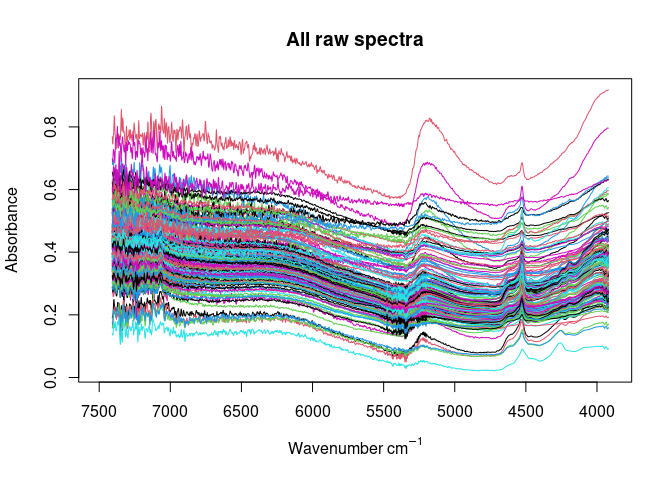
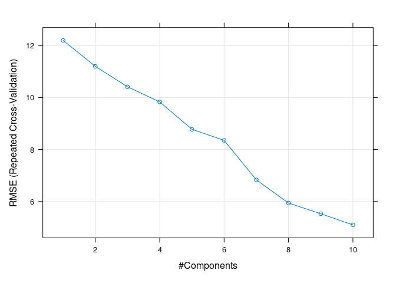
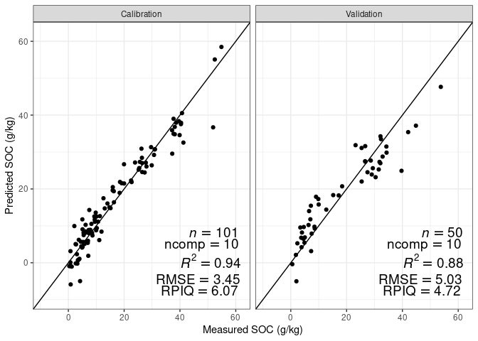

TROPIRES Summer School Uganda August 19–23 2024
================

- [Calibration data](#calibration-data)
  - [TropSOC data from Uganda (cropland and
    forest)](#tropsoc-data-from-uganda-cropland-and-forest)
  - [Uganda samples from PhD project
    Laura](#uganda-samples-from-phd-project-laura)
  - [Calibration modeling
    (cross-validation)](#calibration-modeling-cross-validation)
    - [Pre-process / smoothen spectra](#pre-process--smoothen-spectra)
    - [Visualization](#visualization)
    - [PLS modeling](#pls-modeling)
  - [Calibration modeling (independent
    validation)](#calibration-modeling-independent-validation)
- [Validation samples](#validation-samples)
- [Prediction samples](#prediction-samples)

**Data for soil near-infrared calibration modeling exercises**

*Leonardo Ramirez-Lopez, Moritz Mainka, Laura Summerauer*


# Calibration data

## TropSOC data from Uganda (cropland and forest)

- Forest samples were taken from the Kibale National Park
- Cropland samples were taken from the Rwenzori foothills, West of
  Kibale National Park

``` r
tropsoc_data <- readRDS("data/calibration_data/NIRabs_TropSOC_Uganda.rds")

str(tropsoc_data)
```

    ## 'data.frame':    100 obs. of  9 variables:
    ##  $ sample_id   : chr  "UF10C1" "UF10C10" "UF10C4" "UF10C7" ...
    ##  $ core_id     : chr  "UF10" "UF10" "UF10" "UF10" ...
    ##  $ country_code: chr  "UGA" "UGA" "UGA" "UGA" ...
    ##  $ lat         : num  0.522 0.522 0.522 0.522 0.516 ...
    ##  $ long        : num  30.2 30.2 30.2 30.2 30.2 ...
    ##  $ land_use    : chr  "cropland" "cropland" "cropland" "cropland" ...
    ##  $ depth       : chr  "0-10" "90-100" "30-40" "60-70" ...
    ##  $ TC_gkg      : num  31.79 7.3 27.49 8.27 32.91 ...
    ##  $ abs         : num [1:100, 1:1745] 0.571 0.564 0.605 0.656 0.609 ...
    ##   ..- attr(*, "dimnames")=List of 2
    ##   .. ..$ : NULL
    ##   .. ..$ : chr [1:1745] "7408" "7406" "7404" "7402" ...

- Absorbance spectra in NIR range
- Units are wavenumbers (1 / cm)

``` r
range(as.numeric(colnames(tropsoc_data$abs)))
```

    ## [1] 3920 7408

## Uganda samples from PhD project Laura

cropland samples only from:

- Rwenzori foothills (West of Kibale NP)
- East of Kibale NP
- Saaka / volcanic area in Fort Portal (Saaka University campus)
- I very much recommend to **remove Saaka samples prior to modeling**,
  since these are substantially different from all the other samples!!

``` r
laura_data <- readRDS("data/calibration_data/NIRabs_PhDLaura_Uganda.rds")

str(laura_data)
```

    ## 'data.frame':    105 obs. of  9 variables:
    ##  $ sample_id   : chr  "uga_saak1_p2_0-10" "uga_saak1_p2_10-20" "uga_saak1_p2_20-30" "uga_saak1_p2_30-40" ...
    ##  $ core_id     : chr  "uga_saak1_p2" "uga_saak1_p2" "uga_saak1_p2" "uga_saak1_p2" ...
    ##  $ country_code: chr  "UGA" "UGA" "UGA" "UGA" ...
    ##  $ lat         : num  0.693 0.693 0.693 0.693 0.693 ...
    ##  $ long        : num  30.2 30.2 30.2 30.2 30.2 ...
    ##  $ land_use    : chr  "cropland" "cropland" "cropland" "cropland" ...
    ##  $ depth       : chr  "0-10" "10-20" "20-30" "30-40" ...
    ##  $ TC_gkg      : num  85.7 86.2 123.6 183.9 180.6 ...
    ##  $ abs         : num [1:105, 1:1745] 0.675 0.667 0.704 0.711 0.701 ...
    ##   ..- attr(*, "dimnames")=List of 2
    ##   .. ..$ : NULL
    ##   .. ..$ : chr [1:1745] "7408" "7406" "7404" "7402" ...

## Calibration modeling (cross-validation)

- Use here merged TropSOC and Laura samples (except volcanic Saaka
  samples)
- 151 samples

``` r
alldata <- readRDS("data/calibration_data/NIRabs_allUganda_noSaaka.rds")

str(alldata)
```

    ## 'data.frame':    151 obs. of  9 variables:
    ##  $ sample_id   : chr  "21_uga_kaj_p1_0-10" "21_uga_kaj_p1_10-20" "21_uga_kaj_p1_20-30" "21_uga_kaj_p1_30-40" ...
    ##  $ core_id     : chr  "21_uga_kaj_p1" "21_uga_kaj_p1" "21_uga_kaj_p1" "21_uga_kaj_p1" ...
    ##  $ country_code: chr  "UGA" "UGA" "UGA" "UGA" ...
    ##  $ lat         : num  0.837 0.837 0.837 0.837 0.837 ...
    ##  $ long        : num  30.5 30.5 30.5 30.5 30.5 ...
    ##  $ land_use    : chr  "cropland" "cropland" "cropland" "cropland" ...
    ##  $ depth       : chr  "0-10" "10-20" "20-30" "30-40" ...
    ##  $ TC_gkg      : num  52.5 54.9 40.7 40.4 39.6 ...
    ##  $ abs         : num [1:151, 1:1745] 0.551 0.769 0.631 0.685 0.559 ...
    ##   ..- attr(*, "dimnames")=List of 2
    ##   .. ..$ : NULL
    ##   .. ..$ : chr [1:1745] "7408" "7406" "7404" "7402" ...

### Pre-process / smoothen spectra

``` r
wavs <- as.numeric(colnames(alldata$abs))
wavs_pre <- as.numeric(colnames(alldata$abs_pre))

alldata$abs_pre <- alldata$abs |>
  prospectr::movav(w = 19)
  # detrend(wav = wavs_pre, p = 2)
  # standardNormalVariate() 
  # savitzkyGolay(m = 2, p = 2, w = 17) 
```

### Visualization

``` r
# raw absorbance
matplot(x = as.numeric(colnames(alldata$abs)), y = alldata$abs[1,],
        xlab = expression(paste("Wavenumber ", cm^{-1})),
        ylab = 'Absorbance',
        type = 'l',
        lty = 1, 
        main = "Raw spectra",
        # ylim = c(0.2, 0.8),
        xlim = c(7500, 3900))
```

<!-- -->

``` r
# pre-processed absorbance data
matplot(x = as.numeric(colnames(alldata$abs_pre)), y = alldata$abs_pre[1,],
        xlab = expression(paste("Wavenumber ", cm^{-1})),
        ylab = 'Absorbance',
        type = 'l',
        lty = 1, 
        main = "Pre-processed spectra",
        # ylim = c(0.2, 0.8),
        xlim = c(7500, 3900))
```

<!-- -->

### PLS modeling

``` r
library(caret)
library(tidyverse)

# maxiumum number of components
pls_ncomp_max <- 10

## define trainControl
train_control <- trainControl(
  method = "repeatedcv",
  savePredictions = TRUE, selectionFunction = "oneSE"
)

alldata$rowIndex <- c(1:nrow(alldata))


## train a pls regression model
pls_model <- train(x = alldata$abs_pre,
                       y = alldata$TC_gkg,
                       method = "pls",
                       tuneLength = pls_ncomp_max,
                       trControl = train_control,
                       preProcess = c("center", "scale"))


pls_model
```

    ## Partial Least Squares 
    ## 
    ##  151 samples
    ## 1727 predictors
    ## 
    ## Pre-processing: centered (1727), scaled (1727) 
    ## Resampling: Cross-Validated (10 fold, repeated 1 times) 
    ## Summary of sample sizes: 135, 137, 135, 136, 136, 137, ... 
    ## Resampling results across tuning parameters:
    ## 
    ##   ncomp  RMSE       Rsquared   MAE     
    ##    1     12.080374  0.2543129  9.980546
    ##    2     11.045275  0.3627028  8.924150
    ##    3     10.207985  0.4615876  8.374353
    ##    4      9.509799  0.5400361  7.624794
    ##    5      8.701943  0.6512763  7.221147
    ##    6      8.212535  0.6665924  6.969754
    ##    7      6.674558  0.7897031  5.319061
    ##    8      5.601007  0.8421400  4.365150
    ##    9      5.297296  0.8662382  4.134605
    ##   10      4.813923  0.8872509  3.720502
    ## 
    ## RMSE was used to select the optimal model using  the one SE rule.
    ## The final value used for the model was ncomp = 10.

``` r
plot(pls_model)
```

<!-- -->

``` r
range(alldata$TC_gkg)
```

    ## [1]  0.334 54.860

<!-- -->

## Calibration modeling (independent validation)

``` r
# kennard-Stone sampling for independent validation
kS <- prospectr::kenStone(X = alldata$abs_pre, k = 2/3*nrow(alldata),
               metric = "mahal", pc = 10,
               # group = as.factor(alldata$core_id),
               .center = TRUE, .scale = FALSE)


calset <- alldata[kS$model,]
valset <- alldata[kS$test,]

calset$rowIndex <- c(1:nrow(calset))

## train a pls regression model
pls_model_iv <- caret::train(x = calset$abs_pre,
                          y = calset$TC_gkg,
                          method = "pls",
                          tuneLength = pls_ncomp_max,
                          trControl = train_control,
                          preProcess = c("center", "scale"))

pls_model_iv
```

    ## Partial Least Squares 
    ## 
    ##  101 samples
    ## 1727 predictors
    ## 
    ## Pre-processing: centered (1727), scaled (1727) 
    ## Resampling: Cross-Validated (10 fold, repeated 1 times) 
    ## Summary of sample sizes: 90, 90, 91, 90, 91, 92, ... 
    ## Resampling results across tuning parameters:
    ## 
    ##   ncomp  RMSE       Rsquared   MAE     
    ##    1     12.081954  0.2412592  9.949465
    ##    2     11.203094  0.3548182  9.086711
    ##    3     10.588919  0.4283982  8.668112
    ##    4      9.918314  0.5191765  8.025997
    ##    5      8.703050  0.6175356  7.236534
    ##    6      8.467155  0.6520597  7.123535
    ##    7      7.246866  0.7549499  5.891459
    ##    8      6.293280  0.8163976  5.006314
    ##    9      5.974449  0.8405760  4.679894
    ##   10      5.553139  0.8504807  4.321611
    ## 
    ## RMSE was used to select the optimal model using  the one SE rule.
    ## The final value used for the model was ncomp = 9.

<!-- -->

# Validation samples

These validation samples will be measured with an infrared spectrometer.
Since we have available SOC data from the laboratory, we can use these
samples to validate our models.

- Samples were provided by Matt Cooper
- Samples from Kibale National Park
- Dried, sieved and ground soil
- Reference SOC data were measured at ETH Zurich using dry combustion

``` r
validation_samples <- read_csv("data/validation_samples/validation_samples.csv")

head(validation_samples)
```

    ## # A tibble: 6 × 10
    ##   sample_id  core_id depth_start depth_end increment_length   lat  long Location
    ##   <chr>      <chr>         <dbl>     <dbl>            <dbl> <dbl> <dbl> <chr>   
    ## 1 1052_1020  1052             10        20               10 0.405  30.3 Active  
    ## 2 1053_0010  1053              0        10               10 0.405  30.3 Active  
    ## 3 1151_0010  1151              0        10               10 0.389  30.3 Active  
    ## 4 1273_8090  1273             80        90               10 0.306  30.3 Active  
    ## 5 2012_0010  2012              0        10               10 0.387  30.3 Active  
    ## 6 2021_1001… 2021            100       110               10 0.390  30.3 Active  
    ## # ℹ 2 more variables: History <chr>, TC_gkg <dbl>

# Prediction samples

These prediction samples will be measured with an infrared spectrometer.
After knowing the uncertainty of such prediction models by the
validation samples (above), we can use the established model to predict
SOC data for these samples.

- Samples were provided by Matt Cooper (2 contrasting soil cores)
- Samples from Kibale National Park
- Dried, sieved and ground soil

``` r
prediction_samples <- read_csv("data/prediction_samples/prediction_samples.csv")

head(prediction_samples)
```

    ## # A tibble: 6 × 9
    ##   sample_id core_id depth_start depth_end increment_length   lat  long Location
    ##   <chr>       <dbl>       <dbl>     <dbl>            <dbl> <dbl> <dbl> <chr>   
    ## 1 1093_0010    1093           0        10               10 0.387  30.3 Active  
    ## 2 1093_1020    1093          10        20               10 0.387  30.3 Active  
    ## 3 1093_2030    1093          20        30               10 0.387  30.3 Active  
    ## 4 1093_3040    1093          30        40               10 0.387  30.3 Active  
    ## 5 1093_4050    1093          40        50               10 0.387  30.3 Active  
    ## 6 1093_5060    1093          50        60               10 0.387  30.3 Active  
    ## # ℹ 1 more variable: History <chr>
